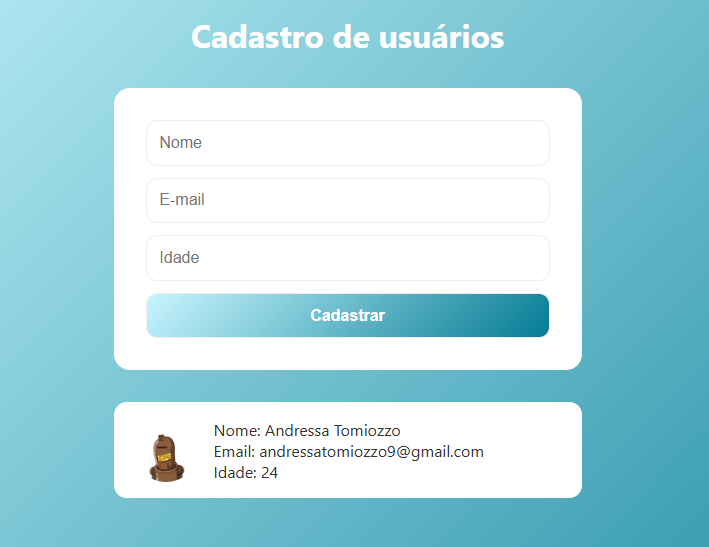

# 📌 Cadastro de usuário

Página inspirada em uma aula do professor Rodolfo Mori.
<https://www.youtube.com/watch?v=hHcaVgoLLQM>

## 🚀 Tecnologias utilizadas

* HTML 5
* CSS 3
* JavaScript ES6+
* React
* Vite

---

## 🎯 Funcionalidades

* [ ] Pegar informações do usuário (nome, e-mail, idade)
* [ ] Mostrar as informações na tela

---

## 📸 Preview


```md

```

---

## ⚙️ Como rodar o projeto

```bash
# Clonar o repositório
git clone https://github.com/andressatomiozzo/react.git

# Entrar na pasta
cd 002-user-registration-1

# Instalar dependências
npm install

# Rodar o projeto
npm run dev
```

---


## 🧠 Aprendizados

Descreva o que você aprendeu com esse projeto:

* Trabalhar com estado no React
* Manipulação de DOM
* Organização de código
