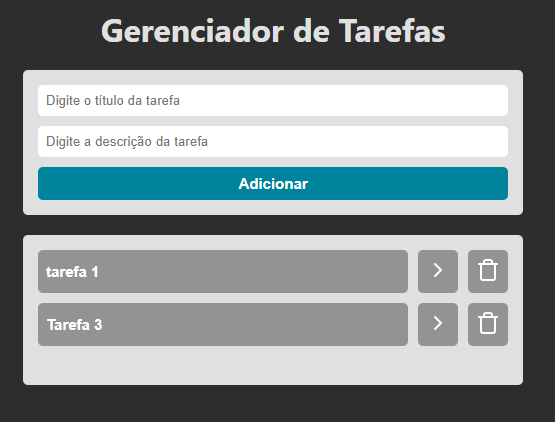
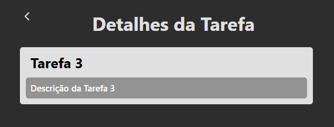

# 📌 Gerenciador de tarefas

Página inspirada em uma aula do professor Felipe Rocha.
<https://www.youtube.com/watch?v=2RWsLmu8yVc>

---

## 🚀 Tecnologias utilizadas

* HTML 5
* CSS 3
* TypeScript
* Vite
* uuid
* React
* React Router


---

## 🎯 Funcionalidades

* [ ] Adicionar tarefas
* [ ] Remover tarefas
* [ ] Visualizar detares da tarefa em outra página
* [ ] Persistência de dados (localStorage)

---

## 📸 Preview

*(adicione um print ou GIF do projeto aqui)*

```md

```
```md

```

---

## ⚙️ Como rodar o projeto

```bash
# Clonar o repositório
git clone https://github.com/andressatomiozzo/react.git

# Entrar na pasta
cd 003-to-do-list

# Instalar dependências
npm install

# Rodar o projeto
npm run dev
```

---


## 🧠 Aprendizados

* Trabalhar com estado no React
* Manipulação de DOM
* Navegar entre páginas
* Guardar os dados no localstorage
* Organização de código
